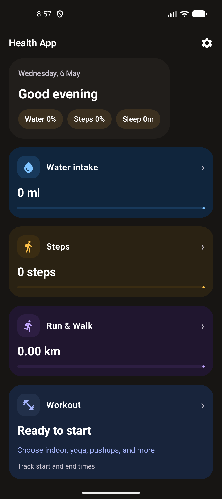
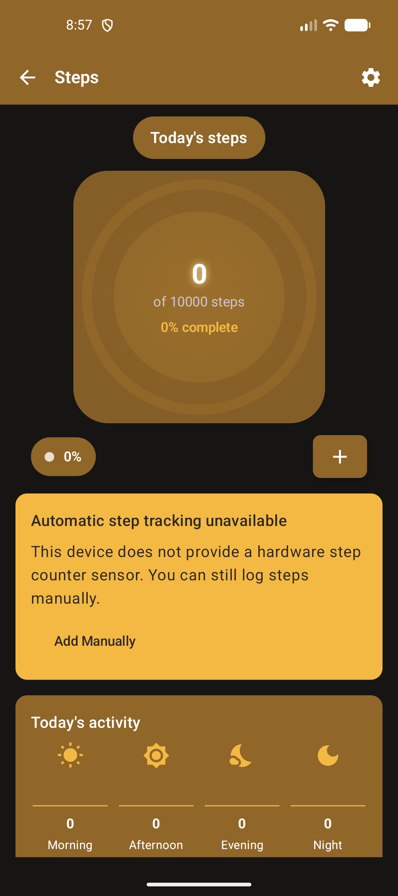
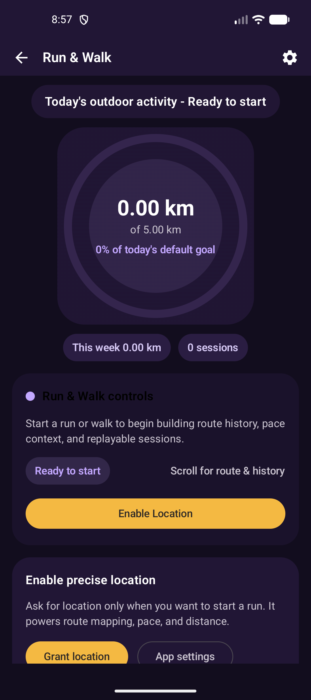
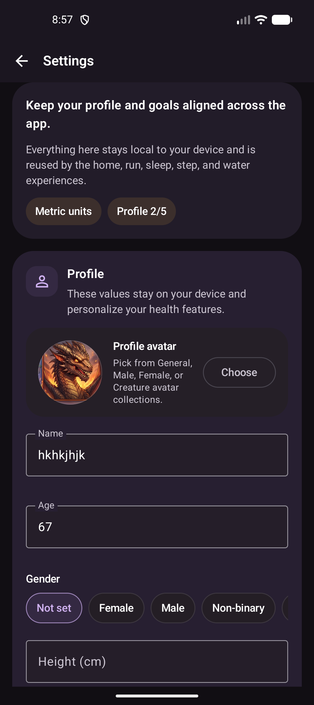
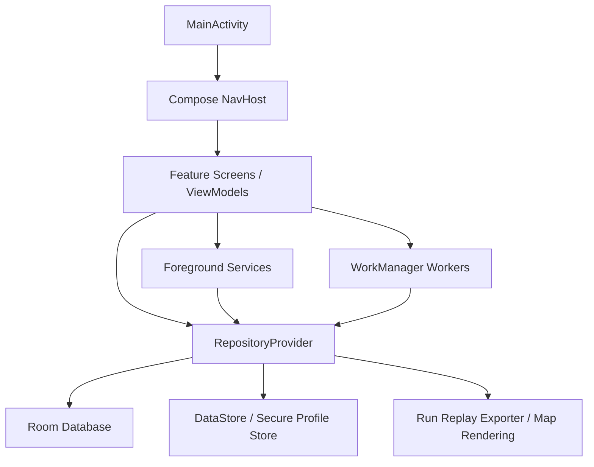

# ProductivityApp

An Android wellness tracker built with **Jetpack Compose**, **Room**, **DataStore**, **WorkManager**, and **foreground services** for day-to-day health routines.

It brings together **steps**, **run/walk tracking**, **sleep logging**, **water intake**, **workouts**, **mindfulness**, reminders, and replayable run history in a single local-first app.

## Screenshots

| Home | Steps |
| --- | --- |
|  |  |

| Run & Walk | Settings |
| --- | --- |
|  |  |

## What this project is

ProductivityApp is a single-activity Android app that focuses on personal wellness tracking without requiring an account. The app stores most data on-device and uses Android platform capabilities to support:

- **Step tracking** with activity recognition and a foreground step service
- **Run & walk tracking** with GPS, route history, analytics, and replay export
- **Sleep tracking** with manual logs plus scheduled maintenance/reminder flows
- **Water intake tracking** with goal progress and per-day entries
- **Workouts and mindfulness** for structured offline wellness logging
- **Reminders and recovery UX** so tracking can survive reboot/process recreation

## Feature highlights

- Modern **Jetpack Compose** UI with a dashboard-style home screen
- Dedicated feature screens for steps, run/walk, sleep, water, settings, workouts, and mindfulness
- **Room** persistence for activity history
- **Proto/DataStore + encrypted profile storage** for settings and user profile data
- **WorkManager** jobs for midnight reset, sleep maintenance, and health reminders
- **Foreground services** for step tracking and run tracking
- **MapLibre** route visualization and MP4 run replay export/sharing
- App-wide route safety via a build-time `verifyNoHardcodedRoutes` check

## Architecture

### High-level design

- **Single module, single activity**: `MainActivity` owns the Compose `NavHost` and schedules recurring background work on startup.
- **Navigation contract**: all route names live in `app/src/main/java/com/example/productivityapp/navigation/AppRoutes.kt`.
- **UI split**:
  - `com.example.productivityapp.app.ui.*` contains the newer app shell surfaces like Home and Water
  - `com.example.productivityapp.ui.*` contains the live feature screens for steps, run, sleep, settings, workouts, and mindfulness
- **Data layer**:
  - `AppDatabase` / Room stores steps, step samples, runs, run points, sleep sessions, workouts, and mindfulness data
  - `UserDataStore` handles water entries, theme preference, and legacy profile-backed storage
  - `SecureAwareUserProfileRepository` bridges legacy profile storage and the secure proto-backed profile store
- **Service and worker layer**:
  - `StepCounterService` records live step deltas
  - `RunTrackingService` records location points and updates active runs
  - `MidnightResetWorker`, `SleepMaintenanceWorker`, and `HealthReminderWorker` keep daily state and reminders in sync
  - `BootCompleteReceiver` re-schedules background work after reboot
- **Composition root**: `RepositoryProvider` wires repositories, storage, exporters, and helpers without a DI framework

### Architecture flow



### Key code entry points

| Area | File |
| --- | --- |
| App entry | `app/src/main/java/com/example/productivityapp/MainActivity.kt` |
| Repository wiring | `app/src/main/java/com/example/productivityapp/data/RepositoryProvider.kt` |
| Database | `app/src/main/java/com/example/productivityapp/data/AppDatabase.kt` |
| Navigation routes | `app/src/main/java/com/example/productivityapp/navigation/AppRoutes.kt` |
| Step tracking service | `app/src/main/java/com/example/productivityapp/service/StepCounterService.kt` |
| Run tracking service | `app/src/main/java/com/example/productivityapp/service/RunTrackingService.kt` |
| Sleep maintenance | `app/src/main/java/com/example/productivityapp/service/SleepMaintenanceWorker.kt` |

## Tech stack

- **Language**: Kotlin
- **UI**: Jetpack Compose + Material 3
- **Persistence**: Room, Preferences DataStore, Proto DataStore
- **Background work**: WorkManager
- **Location**: Google Play Services Location
- **Security**: AndroidX Security Crypto + secure profile migration layer
- **Maps**: MapLibre
- **Build**: Gradle Kotlin DSL

## Project structure

```text
.
├── app/
│   ├── src/main/java/com/example/productivityapp/
│   │   ├── app/                 # newer app-shell UI + home/water flows
│   │   ├── data/                # database, repositories, models, provider wiring
│   │   ├── datastore/           # DataStore and profile storage
│   │   ├── navigation/          # AppRoutes navigation contract
│   │   ├── run/                 # replay export, map rendering, analytics helpers
│   │   ├── service/             # foreground services, receivers, workers
│   │   ├── ui/                  # feature screens (steps/run/sleep/settings/etc.)
│   │   └── viewmodel/           # state and screen logic
│   ├── src/test/                # JVM / Robolectric tests
│   └── src/androidTest/         # instrumentation and Compose tests
├── docs/
│   └── assets/screenshots/      # README screenshots captured with adb
├── TESTING.md                   # test guide and examples
└── app/README.md                # module-level navigation notes
```

## Getting started

### Requirements

- Android Studio
- JDK 21 for the Gradle daemon in this repo
- Android SDK / emulator or a connected device

### Run locally

```bash
./gradlew :app:assembleDebug
adb install -r app/build/outputs/apk/debug/app-debug.apk
adb shell monkey -p com.example.productivityapp -c android.intent.category.LAUNCHER 1
```

## Build, test, and lint

```bash
# Fast compile verification
./gradlew :app:compileDebugKotlin

# Build debug APK
./gradlew :app:assembleDebug

# Lint
./gradlew :app:lintDebug

# Full JVM/Robolectric test suite
./gradlew :app:testDebugUnitTest --no-daemon --console=plain

# Single JVM test class
./gradlew :app:testDebugUnitTest --tests "com.example.productivityapp.data.repository.impl.StepRepositoryUnitTest" --no-daemon

# Single JVM test method
./gradlew :app:testDebugUnitTest --tests "com.example.productivityapp.data.repository.impl.StepRepositoryUnitTest.testIncrementAndReset" --no-daemon

# Instrumentation tests on a connected device/emulator
./gradlew :app:connectedAndroidTest
```

More test guidance lives in [`TESTING.md`](TESTING.md).

## APK location

After building the debug variant, the APK is available at:

```text
app/build/outputs/apk/debug/app-debug.apk
```

If you later add a release build, the release APK/AAB outputs will appear under the corresponding `app/build/outputs/` directories.

## Notable implementation conventions

- **No hard-coded route strings**: use `AppRoutes` constants for navigation.
- A custom Gradle task, **`verifyNoHardcodedRoutes`**, runs before Kotlin compilation and fails the build on raw route literals.
- `RepositoryProvider` is the app's central wiring point instead of a DI framework.
- Long-running tracking features use **foreground services** plus `UiStateStore` to reconnect cleanly after process recreation.
- Compose UI tests often target extracted `*ScreenContent(...)` composables for deterministic coverage.

## README assets

The screenshots in this README were captured from the Android emulator with `adb` and stored in:

```text
docs/assets/screenshots/
```

## License

No license file is currently included in this repository. Add one before publishing if you want to define reuse terms clearly.
