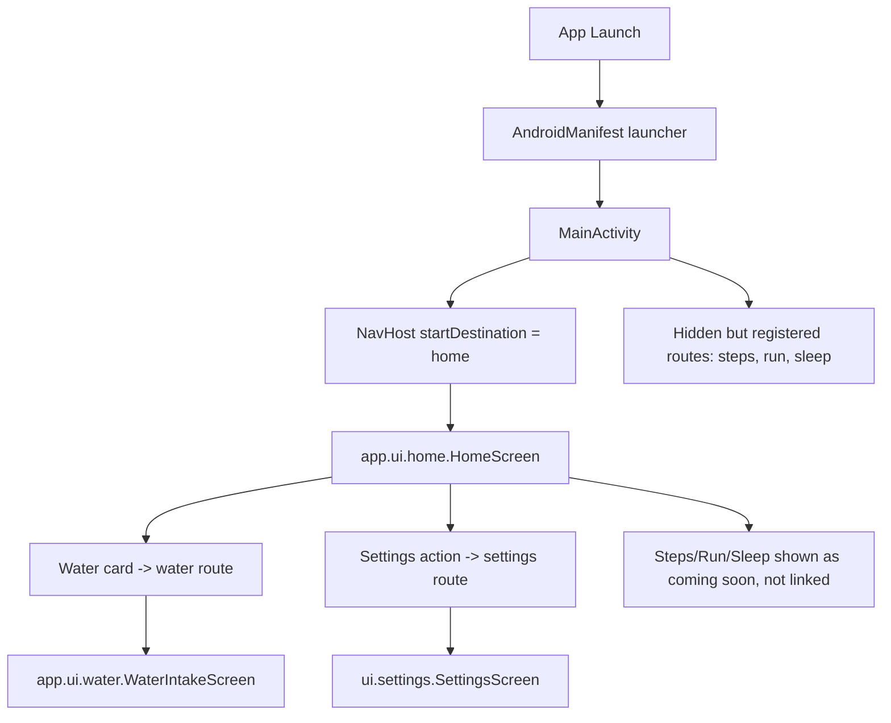
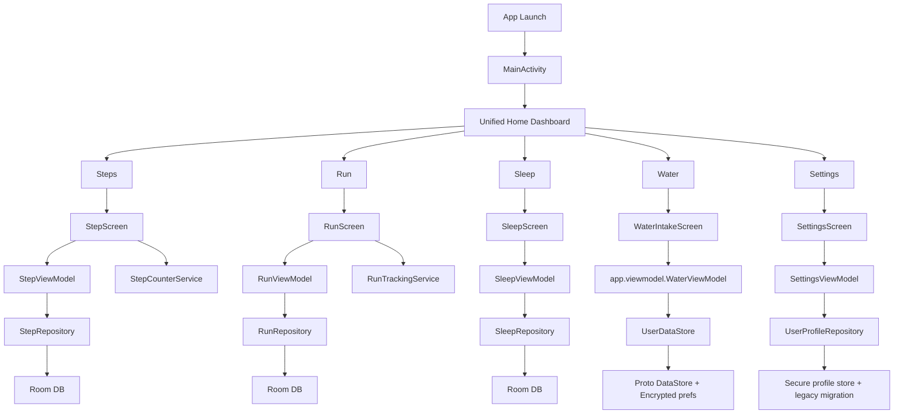
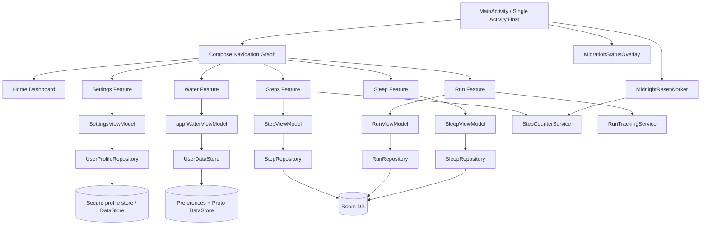
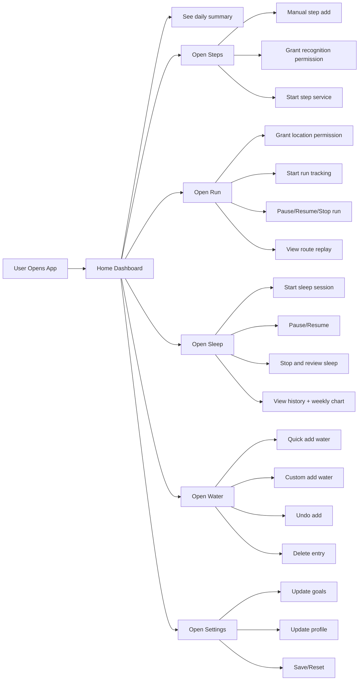
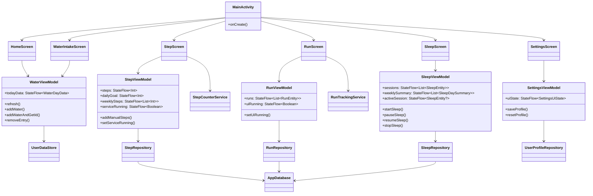
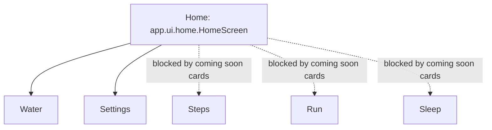
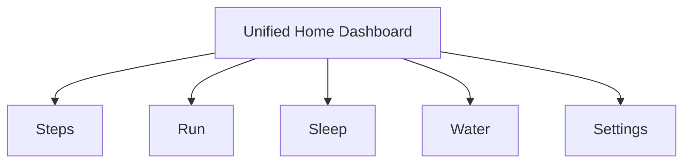

71# ProductivityApp UI Workflow, Architecture Audit, and Navigation Correction Plan

_Date: 2026-04-12_

## Update: Cleanup completed (2026-04-12)

Summary of cleanup performed in this session:

- Centralized navigation routes into `app/src/main/java/com/example/productivityapp/navigation/AppRoutes.kt`.
- Updated `MainActivity.kt` to use the `AppRoutes` constants and to wire the home dashboard to Steps, Run, Sleep, Water, and Settings routes.
- Converted `app/src/main/java/com/example/productivityapp/app/ui/home/HomeScreen.kt` from an incomplete "coming soon" dashboard into the unified home dashboard exposing all implemented features.
- Retired legacy UI files:
  - `app/src/main/java/com/example/productivityapp/ui/home/HomeScreen.kt` (replaced with a retirement marker)
  - `app/src/main/java/com/example/productivityapp/ui/water/WaterIntakeScreen.kt` (replaced with a retirement marker)
- Moved legacy sealed `Screen` model to `app/src/main/java/com/example/productivityapp/app/ui/legacy/Screen.kt` and left a small redirect marker at `app/src/main/java/com/example/productivityapp/app/ui/Screen.kt`.

Build and validation:

- The project compiles successfully after these changes: `./gradlew :app:compileDebugKotlin` → BUILD SUCCESSFUL.
- Deprecated legacy files were replaced with explicit retirement markers to avoid accidental reuse while preserving history.

Notes:

- If you want complete removal of retired files, I can remove them in a follow-up pass (deletion is safe since no references remain).
- I recommend keeping `AppRoutes` as the canonical contract and adding a small lint rule or code review checklist to avoid reintroducing hard-coded route strings.


## 1. Executive Summary

This app is currently a **single-activity Android Compose application** launched by `MainActivity`.

### Current launcher path
- Manifest launcher activity: `app/src/main/AndroidManifest.xml`
- Actual entry activity: `app/src/main/java/com/example/productivityapp/MainActivity.kt`

### Key finding
`MainActivity` currently mixes **two different UI trees**:

1. **Newer/polished UI tree** under:
   - `com.example.productivityapp.app.ui.*`
   - currently used for:
     - `HomeScreen`
     - `WaterIntakeScreen`

2. **Feature-complete/live UI tree** under:
   - `com.example.productivityapp.ui.*`
   - currently used for:
     - `StepScreen`
     - `RunScreen`
     - `SleepScreen`
     - `SettingsScreen`

### Root problem
The launcher home screen is:
- `com.example.productivityapp.app.ui.home.HomeScreen`

That home screen still shows most features as **"COMING SOON"**, even though working feature screens already exist under `com.example.productivityapp.ui.*`.

So the app behavior is inconsistent:
- water + settings are reachable from home
- steps/run/sleep exist in the nav graph
- but the home UI does not expose them
- therefore the user sees an **older/incomplete dashboard experience**

### Recommended architectural direction
Keep the app as a **single-activity Compose app**, but unify the UI around a **single home/dashboard entry screen** that routes to all actual implemented features.

The fastest safe correction is:
1. Keep `MainActivity` as the launcher activity.
2. Keep the current single `NavHost` approach.
3. Replace the old/incomplete `app.ui.home.HomeScreen` behavior with a **unified dashboard** that links to:
   - Steps
   - Run
   - Sleep
   - Water
   - Settings
4. Preserve the newer polished water UI.
5. Remove or retire duplicate screen trees once the cutover is complete.

---

## 2. Codebase Entry Points and UI Ownership

## 2.1 Launcher and top-level app shell

### Manifest
**File:** `app/src/main/AndroidManifest.xml`

Launcher activity:
```xml
<activity
    android:name=".MainActivity"
    android:exported="true"
    android:label="@string/app_name"
    android:theme="@style/Theme.ProductivityApp">
    <intent-filter>
        <action android:name="android.intent.action.MAIN" />
        <category android:name="android.intent.category.LAUNCHER" />
    </intent-filter>
</activity>
```

### Runtime shell
**File:** `app/src/main/java/com/example/productivityapp/MainActivity.kt`

`MainActivity`:
- enables edge-to-edge
- schedules `MidnightResetWorker`
- creates one Compose `NavHost`
- overlays `MigrationStatusOverlay` in debug builds

### Current route table in `MainActivity`
| Route | Screen | Source package | Reachable from home now? | Notes |
|---|---|---|---|---|
| `home` | `AppHomeScreen` | `app.ui.home` | Yes | Old/incomplete dashboard |
| `steps` | `StepScreen` | `ui.steps` | No direct home link | Feature implemented |
| `run` | `RunScreen` | `ui.run` | No direct home link | Feature implemented |
| `sleep` | `SleepScreen` | `ui.sleep` | No direct home link | Feature implemented |
| `water` | `AppWaterScreen` | `app.ui.water` | Yes | New polished water UI |
| `settings` | `SettingsScreen` | `ui.settings` | Yes | Live settings screen |

---

## 3. Duplicate UI Trees: What Exists Today

## 3.1 Newer `app.ui.*` tree
Directory:
- `app/src/main/java/com/example/productivityapp/app/ui/`

Contains:
- `home/HomeScreen.kt`
- `water/WaterIntakeScreen.kt`
- `theme/*`
- `Screen.kt`

### Characteristics
- visually polished
- dashboard-oriented
- water-focused
- not fully integrated with all working features

## 3.2 Existing live `ui.*` tree
Directory:
- `app/src/main/java/com/example/productivityapp/ui/`

Contains:
- `home/HomeScreen.kt`
- `steps/StepScreen.kt`
- `run/RunScreen.kt`
- `sleep/SleepScreen.kt`
- `settings/SettingsScreen.kt`
- `water/WaterIntakeScreen.kt`
- `debug/MigrationStatusOverlay.kt`

### Characteristics
- contains real working feature entry points for multiple health features
- home screen here is very minimal/button-based
- not currently used by `MainActivity`

## 3.3 Why the user sees the wrong experience
`MainActivity.kt` imports (illustrative, shown as plain text to avoid Markdown code-fragment Kotlin parsing):
```text
import com.example.productivityapp.app.ui.home.HomeScreen as AppHomeScreen
import com.example.productivityapp.app.ui.water.WaterIntakeScreen as AppWaterScreen
```

This causes the launcher dashboard to use `app.ui.home.HomeScreen`, whose body contains:
- `WaterIntakeCard(...)`
- `SectionLabel("COMING SOON")`
- `ComingSoonCard("Sleep tracker")`
- `ComingSoonCard("Step counter")`
- `ComingSoonCard("Meditation timer")`

So the app is **not failing because features do not exist**.
It is failing because **the home screen is not wired to the already-implemented routes**.

---

## 4. Current End-to-End UI Workflow

## 4.1 Actual runtime workflow today



## 4.2 Intended workflow after correction



---

## 5. Screen-by-Screen Workflow Details

## 5.1 Main activity workflow

**File:** `app/src/main/java/com/example/productivityapp/MainActivity.kt`

### Responsibilities
- app composition root
- navigation graph owner
- ViewModel creation for home/water/settings
- background midnight worker scheduling
- debug migration overlay host

### Runtime sequence
1. `onCreate()` executes.
2. `enableEdgeToEdge()` is called.
3. `MidnightResetWorker.schedule(applicationContext)` is triggered.
4. Compose content starts.
5. `rememberNavController()` creates navigation controller.
6. `NavHost(startDestination = "home")` is built.
7. `home` route renders `AppHomeScreen`.
8. Overlay renders `MigrationStatusOverlay` on top in debuggable builds.

### Architectural issue in `MainActivity`
The activity is currently acting as a **hybrid composition root** across two UI systems:
- `app.ui.*`
- `ui.*`

This should be consolidated.

---

## 5.2 Home screen workflow (current)

**File:** `app/src/main/java/com/example/productivityapp/app/ui/home/HomeScreen.kt`

### Inputs
- `onNavigateToWater`
- `onNavigateToSettings`
- `waterViewModel`

### Runtime behavior
1. Collects `todayData` from water ViewModel.
2. Calls `waterViewModel.refresh()` via `LaunchedEffect(Unit)`.
3. Shows top app bar with date.
4. Shows greeting card.
5. Shows `WaterIntakeCard`.
6. Shows **COMING SOON** section.
7. Does not expose steps/run/sleep navigation.

### UX problem
This screen visually suggests the other features are not implemented, but they are already live elsewhere.

---

## 5.3 Water intake workflow

**File:** `app/src/main/java/com/example/productivityapp/app/ui/water/WaterIntakeScreen.kt`

### Entry
Triggered by home screen water card.

### Inputs
- `onBack`
- `viewModel: app.viewmodel.WaterViewModel`

### Main user flow
1. Screen collects `todayData` from water ViewModel.
2. Calls `viewModel.refresh()` on first composition.
3. Re-checks date and refreshes if stale after midnight.
4. Shows circular progress ring with total ml / goal.
5. User can:
   - tap quick amount buttons
   - enter custom ml
   - add custom amount
   - delete old entries
   - undo last addition via snackbar
6. Log is displayed newest first.

### Data flow
`WaterIntakeScreen`
-> `app.viewmodel.WaterViewModel`
-> `UserDataStore`
-> water proto store + encrypted/shared profile preferences

### Notes
This is one of the most polished screens in the codebase and should be retained.

---

## 5.4 Steps workflow

**File:** `app/src/main/java/com/example/productivityapp/ui/steps/StepScreen.kt`

### Main user flow
1. Screen builds repository + ViewModel from `RepositoryProvider`.
2. Reads:
   - today step count
   - daily goal
   - service state
   - weekly steps
3. Checks `ACTIVITY_RECOGNITION` permission.
4. Checks hardware step sensor availability.
5. Displays:
   - header
   - progress
   - weekly chart
   - manual quick add / custom add
6. If sensor exists and permission is granted:
   - user can start/stop foreground step service
7. If permission denied:
   - UI requests permission or directs user to app settings

### Service workflow
`StepScreen`
-> `StepViewModel`
-> `StepCounterService`
-> device step sensor
-> `StepRepository`
-> Room DB

### Important observation
This is not a placeholder feature. It is implemented and production-like enough to be linked directly from home.

---

## 5.5 Run workflow

**File:** `app/src/main/java/com/example/productivityapp/ui/run/RunScreen.kt`

### Main user flow
1. Screen creates `RunViewModel` using `RunRepository` + `UiStateStore`.
2. Observes list of runs and latest run.
3. Checks location permission and background location permission.
4. User can:
   - start run
   - stop run
   - pause run
   - resume run
5. Screen shows latest run stats:
   - distance
   - duration
   - speed
   - calories
6. Screen renders route map.
7. Screen provides replay slider / play / reset.

### Service workflow
`RunScreen`
-> `RunTrackingService`
-> location provider
-> `RunRepository`
-> `RunEntity` + `RunPointEntity`
-> Room DB

### Important observation
This feature is implemented and should appear as a real card/action on the home dashboard.

---

## 5.6 Sleep workflow

**File:** `app/src/main/java/com/example/productivityapp/ui/sleep/SleepScreen.kt`

### Main user flow
1. Screen creates `SleepViewModel` with `SleepRepository`.
2. Observes:
   - sessions
   - weekly summary
   - active session
   - elapsed timer
   - pause state
   - pending review session
3. User can:
   - start sleep
   - pause sleep
   - resume sleep
   - stop sleep
4. After stop, user can enter:
   - quality rating
   - notes
5. Weekly chart and session history are displayed.

### Data flow
`SleepScreen`
-> `SleepViewModel`
-> `SleepRepository`
-> Room DB

### Important observation
This is also implemented and should not appear under "coming soon".

---

## 5.7 Settings workflow

**File:** `app/src/main/java/com/example/productivityapp/ui/settings/SettingsScreen.kt`

### Main user flow
1. `SettingsViewModel` loads persisted user profile.
2. User can update:
   - display name
   - weight
   - height
   - stride length
   - preferred units
   - daily step goal
   - daily water goal
3. User can:
   - save settings
   - reset profile
4. Screen explains privacy/storage behavior.

### Data flow
`SettingsScreen`
-> `SettingsViewModel`
-> `UserProfileRepository`
-> secure profile storage + migration coordinator

### Architectural importance
This screen is a cross-feature dependency because:
- step goal drives steps UI
- water goal drives water UI
- stride length influences step/run estimation

---

## 6. High-Level Design (HLD)

## 6.1 System overview



## 6.2 HLD conclusions
- App architecture is already centered on a **single activity + Compose routes**.
- Each feature has its own ViewModel and repository.
- Health features are real and usable.
- Home/dashboard is the only major mismatched layer.
- The correction should therefore target **navigation surface unification**, not a large refactor of business logic.

---

## 7. Low-Level Design (LLD)

## 7.1 `MainActivity` low-level design

### Current responsibilities
- instantiate NavController
- register route composables
- instantiate some ViewModels directly
- bridge UI trees

### Problems
- duplicate package ownership (`app.*` vs `ui.*`)
- home route only accepts water/settings callbacks
- route strings are hardcoded
- `app.ui.Screen` sealed class exists but is not used by `MainActivity`

### LLD recommendation
Create a single navigation contract, for example:
- route constants/sealed objects in one place
- one unified home screen signature
- activity delegates only route selection and ViewModel provisioning

---

## 7.2 Home screen low-level design

### Current `app.ui.home.HomeScreen` signature
```kotlin
fun HomeScreen(
    onNavigateToWater: () -> Unit,
    onNavigateToSettings: () -> Unit,
    waterViewModel: WaterViewModel
)
```

### Required future signature
```kotlin
fun HomeScreen(
    onNavigateToSteps: () -> Unit,
    onNavigateToRun: () -> Unit,
    onNavigateToSleep: () -> Unit,
    onNavigateToWater: () -> Unit,
    onNavigateToSettings: () -> Unit,
    waterViewModel: WaterViewModel
)
```

### Required UI behavior changes
Replace:
- `COMING SOON`
- `ComingSoonCard(...)`

With real feature cards:
- Steps
- Run
- Sleep
- Water
- Settings access

Optional later addition:
- meditation only if actually implemented

---

## 7.3 Water module low-level design

### Screen
`app.ui.water.WaterIntakeScreen`

### ViewModel
`app.viewmodel.WaterViewModel`

### Model
`app.data.model.WaterDayData`, `WaterEntry`

### Persistence
`UserDataStore`
- proto-backed water entry storage
- encrypted shared preferences for user profile fields
- compatibility migration from legacy preferences

### Notes
This module is self-contained and should remain as-is during the first navigation correction pass.

---

## 7.4 Steps module low-level design

### Screen
`ui.steps.StepScreen`

### ViewModel
`viewmodel.StepViewModel`

### Repository
`data.repository.StepRepository`
-> `RoomStepRepository`

### Service
`service.StepCounterService`

### Persistence entity
`StepEntity`

### Notes
Only dashboard exposure/navigation needs correction.

---

## 7.5 Run module low-level design

### Screen
`ui.run.RunScreen`

### ViewModel
`viewmodel.RunViewModel`

### Repository
`data.repository.RunRepository`
-> `RoomRunRepository`

### Service
`service.RunTrackingService`

### Persistence entities
- `RunEntity`
- `RunPointEntity`

### Notes
Only dashboard exposure/navigation needs correction.

---

## 7.6 Sleep module low-level design

### Screen
`ui.sleep.SleepScreen`

### ViewModel
`viewmodel.SleepViewModel`

### Repository
`data.repository.SleepRepository`
-> `RoomSleepRepository`

### Persistence entity
`SleepEntity`

### Notes
Only dashboard exposure/navigation needs correction.

---

## 7.7 Settings module low-level design

### Screen
`ui.settings.SettingsScreen`

### ViewModel
`viewmodel.SettingsViewModel`

### Repository
`data.repository.UserProfileRepository`

### Implementations
- `DataStoreUserProfileRepository`
- `SecureAwareUserProfileRepository`

### Notes
Settings already updates the same goal/profile state used by other features.

---

## 8. Functional Diagram



---

## 9. Class Diagram (conceptual)



---

## 10. Current vs Target Navigation Model

## 10.1 Current



## 10.2 Target



---

## 11. Root-Cause Analysis

## 11.1 Primary cause
The launcher route `home` is bound to `app.ui.home.HomeScreen`, which was built during an earlier UI phase focused primarily on water.

## 11.2 Secondary causes
1. **Duplicate home screens** exist in two packages:
   - `app.ui.home.HomeScreen`
   - `ui.home.HomeScreen`
2. Navigation route ownership is split.
3. One route host (`MainActivity`) imports screens from both UI trees.
4. The sealed `Screen` model in `app.ui.Screen.kt` is not used to drive actual navigation.
5. Home screen API does not support navigation to the already implemented features.

## 11.3 Impact
- misleading UX
- inconsistent product state perception
- difficult onboarding for future contributors
- increased maintenance cost due to duplicate UI trees

---

## 12. Recommended Correction Strategy

## 12.1 Target correction outcome
When the app launches:
- the user lands on a single dashboard
- the dashboard shows all real implemented features
- water remains polished
- settings remains reachable
- no implemented feature is labeled as future/soon

## 12.2 Recommended implementation approach

### Phase 1 — Navigation surface correction (highest value, lowest risk)
Update `app.ui.home.HomeScreen` and `MainActivity` so the home dashboard links to real features.

**Files to update:**
- `app/src/main/java/com/example/productivityapp/MainActivity.kt`
- `app/src/main/java/com/example/productivityapp/app/ui/home/HomeScreen.kt`

### Phase 2 — Navigation contract cleanup
Create a single source of truth for routes.

**Files to update/add:**
- `app/src/main/java/com/example/productivityapp/MainActivity.kt`
- optionally replace/expand `app/src/main/java/com/example/productivityapp/app/ui/Screen.kt`
- optionally add a dedicated `navigation/AppRoutes.kt`

### Phase 3 — Duplicate UI retirement
Retire or clearly mark unused duplicate screens.

Candidates:
- `ui/home/HomeScreen.kt`
- `ui/water/WaterIntakeScreen.kt`

### Phase 4 — Unified design refinement
Bring visual style of steps/run/sleep cards in line with the newer home/water look.

---

## 13. Detailed File-by-File Correction Plan

## 13.1 `MainActivity.kt`

### Current issue
`AppHomeScreen` only accepts:
- water navigation
- settings navigation

### Required change
Pass callbacks for all implemented routes:
- `onNavigateToSteps`
- `onNavigateToRun`
- `onNavigateToSleep`
- `onNavigateToWater`
- `onNavigateToSettings`

### Expected result
Home can become the real application dashboard.

---

## 13.2 `app/ui/home/HomeScreen.kt`

### Current issue
Contains:
- `COMING SOON`
- placeholder feature cards

### Required change
Replace placeholder cards with interactive feature cards.

### Suggested sections
- Health overview
- Activity tracking
- Recovery & hydration

### Suggested card set
1. Steps card
   - current goal hint
   - open `steps`
2. Run card
   - open `run`
3. Sleep card
   - open `sleep`
4. Water card
   - keep current progress summary
5. Settings action
   - stay in top app bar or card/footer

### Important note
The meditation card should be removed or moved to a separate true backlog section, since it is not implemented.

---

## 13.3 `ui/home/HomeScreen.kt`

### Current status
Minimal button-driven screen not used by `MainActivity`.

### Recommended action
Do not use as final dashboard.

### Options
- keep temporarily as legacy/debug screen
- mark deprecated
- delete later after unified home is complete

---

## 13.4 `ui/water/WaterIntakeScreen.kt`

### Current status
Old/simple water screen not used by `MainActivity`.

### Recommended action
Retire after confirming no external references remain.

---

## 14. Detailed UI Workflow per Feature (Targeted Product Flow)

## 14.1 App launch to home
1. User taps app icon.
2. Android launches `MainActivity`.
3. `MainActivity` schedules midnight maintenance.
4. Compose navigation graph initializes.
5. Start destination renders unified home dashboard.
6. Home dashboard shows all implemented features as actionable modules.

## 14.2 Home to steps
1. User taps Steps card.
2. App navigates to `steps` route.
3. `StepScreen` loads current day step data.
4. If permission missing, user is prompted.
5. User may manually add steps or start background step counting.
6. Step count persists in Room.
7. Returning home should preserve nav back behavior and optionally show updated summary later.

## 14.3 Home to run
1. User taps Run card.
2. App navigates to `run` route.
3. `RunScreen` checks foreground/background location access.
4. User starts run.
5. `RunTrackingService` starts as foreground service.
6. GPS points are stored via `RunRepository`.
7. User stops run and sees stats/replay.

## 14.4 Home to sleep
1. User taps Sleep card.
2. App navigates to `sleep` route.
3. `SleepScreen` shows active session state or history.
4. User starts/pauses/resumes/stops sleep.
5. On stop, review dialog/card appears.
6. Session and review persist in Room.

## 14.5 Home to water
1. User taps Water card.
2. App navigates to `water` route.
3. Water screen loads today's entries and goal.
4. User quick-adds or custom-adds water.
5. Undo snackbar offers rollback.
6. Data persists in `UserDataStore`.

## 14.6 Home to settings
1. User taps Settings.
2. App navigates to `settings` route.
3. Profile and goals load.
4. User updates values.
5. Save updates cross-feature configuration.

---

## 15. Risks and Dependencies

## 15.1 Low-risk changes
- adding new navigation callbacks to home
- replacing placeholder cards with real cards
- preserving existing routes

## 15.2 Medium-risk changes
- consolidating duplicate route contracts
- deleting old duplicate files

## 15.3 Existing dependency risks
- water feature uses `app.viewmodel.WaterViewModel`, while other features use `viewmodel.*`
- route strings are raw strings in `MainActivity`
- duplicate package trees may confuse future development if not retired

---

## 16. Exact Next Implementation Command Scope

If the next task is to implement the correction, it should target this scope first:

### Next change package
**Primary objective:** turn the current home into the real dashboard.

### Files to edit next
1. `app/src/main/java/com/example/productivityapp/MainActivity.kt`
2. `app/src/main/java/com/example/productivityapp/app/ui/home/HomeScreen.kt`

### What the next change should do
1. Expand `HomeScreen` parameters to include:
   - `onNavigateToSteps`
   - `onNavigateToRun`
   - `onNavigateToSleep`
2. Replace `COMING SOON` cards with clickable feature cards.
3. Wire those cards in `MainActivity` to:
   - `navController.navigate("steps")`
   - `navController.navigate("run")`
   - `navController.navigate("sleep")`
4. Keep water card linked to `water`.
5. Keep settings action linked to `settings`.

### Strongly recommended follow-up after that
- create centralized route constants
- deprecate duplicate `ui/home/HomeScreen.kt`
- deprecate duplicate `ui/water/WaterIntakeScreen.kt`

---

## 17. Suggested Implementation Order

### Sprint order
1. **Fix home navigation exposure**
2. **Unify route constants**
3. **Deprecate duplicate home/water screens**
4. **Add richer dashboard summaries for steps/run/sleep**
5. **Optional design system harmonization**

### Reasoning
This sequence delivers the biggest user-visible improvement with the smallest code risk.

---

## 18. Final Recommendation

Do **not** replace `MainActivity` with multiple activities.

Instead:
- keep `MainActivity` as the single Compose host
- keep the polished water UI from `app.ui.water`
- convert `app.ui.home.HomeScreen` into the real dashboard
- connect it to the already implemented steps/run/sleep/settings routes
- then gradually remove duplicate legacy screens

This yields the cleanest path from the current mixed UI state to a coherent app architecture.

---

## 19. Short Answer to the Core Problem

### Why is the app still showing future features?
Because `MainActivity` points to `app.ui.home.HomeScreen`, and that screen still hardcodes a `COMING SOON` section instead of linking to the already implemented feature routes.

### What should be corrected first?
Update:
- `MainActivity.kt`
- `app/ui/home/HomeScreen.kt`

### What should the next command do?
Implement a unified home dashboard that navigates to:
- Steps
- Run
- Sleep
- Water
- Settings

That is the highest-value next step.

